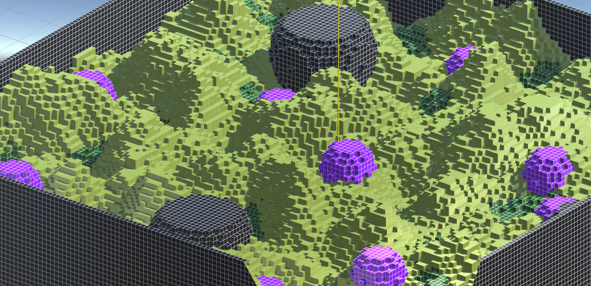
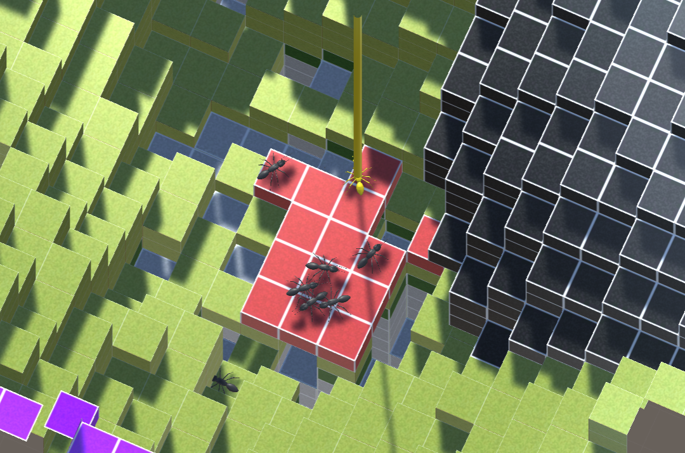
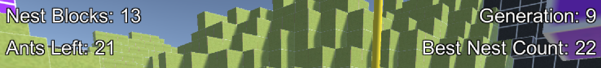

# Antymology -- Evolutionary Ant Colony Simulation

Antymology is a 3D ant colony simulation built in Unity where virtual ants evolve over multiple generations to maximize nest production. The project combines procedurally generated voxel terrain with an evolutionary algorithm that breeds increasingly effective ant colonies. Worker ants forage for food, dig through terrain, and feed a queen ant who converts that energy into nest blocks. Each generation, the ants that performed best pass their genes on to the next batch, so over time the colony gets better at building nests.

## Table of Contents

- [Project Overview](#project-overview)
- [How It Works](#how-it-works)
  - [World Generation](#world-generation)
  - [Ant Behavior](#ant-behavior)
  - [Pheromone System](#pheromone-system)
  - [Evolutionary Algorithm](#evolutionary-algorithm)
- [UI and Controls](#ui-and-controls)
- [How to Run](#how-to-run)

## Project Overview

The core idea is straightforward: a colony of ants is dropped onto a procedurally generated landscape and has to survive long enough to build as many nest blocks as possible. Ants lose health every tick and die when it reaches zero. The only way to stay alive is to dig up and eat Mulch blocks scattered throughout the terrain. Worker ants collect food and share their excess health with a single queen ant, who spends that health to place nest blocks into the world. When the queen dies, the generation ends, the world resets, and a new generation of ants is spawned using genes inherited from the best performers of previous generations.

Over many generations, the evolutionary pressure pushes the colony toward strategies that produce more nests: workers that are better at finding food, more efficient at returning to the queen, and smarter about when to dig.

## How It Works

### World Generation

The world is a chunk-based environment made up of a 3D grid of blocks, each belonging to one of several types:

- **Stone** -- The base layer of the terrain. Ants can dig through it but it provides no nutrition.
- **Grass** -- Sits on top of stone. Also diggable with no food value.
- **Mulch** -- The food source. When an ant stands on a mulch block and digs it, the block is removed and the ant regains a third of its maximum health.
- **Acidic** -- Hazardous blocks that double the rate of health decay for any ant standing on them.
- **Container** -- Indestructible blocks that form the world boundary and spherical obstacles. Ants cannot dig these.
- **Nest** -- Placed by the queen ant. The total count of these is the fitness metric for the simulation.
- **Air** -- Empty space. Also carries pheromone data used for ant navigation.

### Ant Behavior

There are two types of ants in the simulation, both inheriting from a shared base class (`AntBase`) that handles health, movement, ground detection, and digging.

**Worker Ants** are the backbone of the colony. Each worker has a maximum health of 750 and loses 1 health per tick (2 per tick if standing on an acidic block). Workers operate in two modes depending on their current health:

- *Foraging mode* (health below a threshold): The worker moves randomly across the terrain and uses a neighbourhood-based ruleset to decide when to dig. The ruleset encodes the 5 blocks touching the ant (below, left, right, back, forward) into a string key, and looks up whether the ant should dig or do nothing. This ruleset is the primary gene that evolves across generations.
- *Feeding mode* (health above a threshold): The worker follows pheromone gradients toward the queen. When it reaches the queen's block, it transfers its excess health to her. Workers also deposit their own trail pheromone as they move, helping other workers find paths to the queen.

Workers are constrained to climbing at most 2 blocks up and dropping at most 2 blocks down per move. They cannot eat a mulch block if another ant is already on it.

**The Queen Ant** is visually distinct with a gold color and a tall pillar above her for easy identification. She moves at one-third the speed of workers and has a simpler behavior loop: wander randomly, drop queen pheromone every tick, and place a nest block whenever her health exceeds a configurable threshold. Placing a nest costs one-third of her maximum health. The queen deposits pheromone into the air above her position, which diffuses outward over time and acts as a beacon that workers can follow.

### Pheromone System

The pheromone system is implemented directly in the `AirBlock` class. Every air block in the world can hold two types of pheromone: queen pheromone and worker pheromone. Each tick, the system processes all active pheromone blocks:

1. **Evaporation** -- Each pheromone value decays by a small percentage per tick (0.1% for queen, 0.5% for worker). Values below 0.1 are zeroed out.
2. **Diffusion** -- Each block shares a fraction of its pheromone with its 6 direct neighbors (6% for queen, 4% for worker), creating a gradient that spreads outward from the source.

Workers use this gradient for navigation. When in feeding mode, a worker checks the pheromone concentration in its 8 horizontal neighbors and moves toward the one with the highest combined queen + worker pheromone, with some randomness to avoid all workers taking the exact same path. There is also a 24% chance each tick that a feeding worker moves randomly instead of following pheromone, which helps prevent the colony from getting stuck in local optima.

### Evolutionary Algorithm

Evolution is managed by the `EvolutionManager` singleton and is triggered whenever the queen dies (ending the current generation). The process works as follows:

**Fitness Evaluation:**
- Queen fitness = number of nest blocks placed during her lifetime.
- Worker fitness = total energy given to the queen + (mulch blocks eaten x 50). This rewards both food collection and queen-feeding behavior.

**Gene Representation:**
- Each queen has one gene: the health threshold at which she places nest blocks (constrained between 50% and 90% of max health).
- Each worker has two genes: the health threshold at which it switches from foraging to feeding mode, and its neighbourhood ruleset (a dictionary of 7,776 entries mapping 5-block patterns to actions).

**Selection:**
- Tournament selection with a tournament size of 3 is used for both queen and worker breeding.
- A breeding pool is maintained that combines the top 20 all-time best workers with a random sample of 10 workers from the most recent generation. This balances exploitation of proven strategies with exploration of new ones.

**Crossover and Mutation:**
- Queen thresholds are averaged from two parents, then mutated by a small random offset.
- Worker rulesets use uniform crossover: for each of the 7,776 rules, the child randomly inherits from one parent or the other. After crossover, 5% of rules are randomly mutated to new actions.
- The top 5 workers from all time are carried over as elites directly into the next generation without modification.

**Generation Cycle:**
1. Queen dies, triggering end-of-generation.
2. All living workers are recorded and scored.
3. The world terrain is regenerated from scratch.
4. A new queen is spawned with evolved threshold genes.
5. 20 new workers are spawned: 5 elite carry-overs + 15 bred from the pool.

## UI and Controls

The simulation includes an on-screen HUD and a free-flying camera:

**HUD (heads-up display):**
- Top-left corner: current nest block count and number of living ants.
- Top-right corner: current generation number and the best nest count achieved across all generations.

**Camera Controls:**
- **WASD** -- Move forward, left, backward, right.
- **Q / E** -- Move up / down.
- **Middle mouse button (hold)** -- Look around.
- **Left Shift (hold)** -- Accelerate camera movement.
- **Space (hold)** -- Lock vertical position (move only on X/Z plane).

**Terrain Editor (for debugging):**
- **1-5 keys** -- Select block type (1=Acidic, 2=Container, 3=Grass, 4=Mulch, 5=Stone).
- **Left click** -- Place a block.
- **Right click** -- Remove a block.

## How to Run

1. Install **Unity 6** (version 6000.3.6f1 or compatible).
2. Clone this repository.
3. Open the project folder in Unity Hub.
4. Open the scene located in `Assets/Scenes/`.
5. Press Play in the Unity Editor.

The simulation will generate the terrain and spawn the first generation of ants automatically. Use the fly camera to explore the world and watch the ants work. The HUD will show real-time stats. When the queen dies, the next generation will spawn automatically with evolved genes.